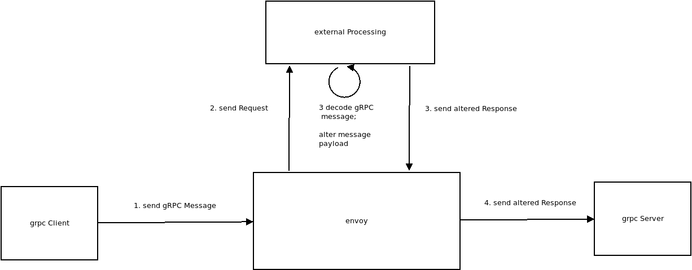

## Decoding gRPC Messages using Envoy

Envoy configuration set which decodes gRPC messages in several ways:

1. `envoy.filters.http.proto_message_extraction`
2. `envoy.filters.http.grpc_field_extraction`
3. `envoy.filters.http.ext_proc`

The first two will extract _basic_ (text/timestamp/numeric) fields only and make them available as envoy metadata to use in other filters.

The external processing filter will allow for full mutation.

### External Processing filter

With the [External Processing Filter](https://www.envoyproxy.io/docs/envoy/latest/api-v3/extensions/filters/http/ext_proc/v3/processing_mode.proto) will decode it externally and alters gRPC messages.

In this flow, the envoy filter will recieve gRPC messages from clients over TLS, then decode and send an altered message to the gRPC Server.





This sample builds ontop of these articles:

* [Envoy External Processing Filter](https://blog.salrashid.dev/articles/2021/envoy_ext_proc/)
* [gRPC Unary requests the hard way: using protorefelect, dynamicpb and wire-encoding to send messages](https://blog.salrashid.dev/articles/2022/grpc_wireformat/)


Basically, the external filter decode the grpc wireformat message into byte messages using (`"github.com/psanford/lencode"`), then `proto.Unmarshal` that into an actual gRPC message we can inspect.


---

In this demo, given the proto

```proto
syntax = "proto3";

package echo;

service EchoServer {
  rpc SayHelloUnary (EchoRequest) returns (EchoReply) {}
  rpc SayHelloServerStream(EchoRequest) returns (stream EchoReply) {}
}

message EchoRequest {
  string name = 1;
}

message EchoReply {
  string message = 1;
}
```

if the client sends `SayHelloUnary` using  `EchoRequest` with `name=alice`, the filter will alter the payload and send `name=bob` to the grpcServer

if the client sends`SayHelloServerStream` with `name=carol`, the gRPC server will stream two responses back with `message="hi carol"`.  However the filter will alter the final grpc message to the client as `message="hi sally"`


```bash
cd ext_proc/

# start external processing server
go run filter.go

## Start envoy
### docker cp `docker create envoyproxy/envoy-dev:latest`:/usr/local/bin/envoy .
envoy -c envoy_ext_proc.yaml -l debug
```


THen the grpc client and server.

```bash
cd grpc_server/

# run server
go run greeter_server/grpc_server.go --grpcport :50051 

# test client directly to server
go run greeter_client/grpc_client.go --host localhost:50051
    2022/10/19 17:37:46 hi alice
    2022/10/19 17:37:46 hi carol
    2022/10/19 17:37:46 hi carol

# test client via envoy
go run greeter_client/grpc_client.go --host localhost:8081
    2022/10/19 17:37:56 hi bob
    2022/10/19 17:37:57 hi sally
    2022/10/19 17:37:57 hi sally
```


### Proto message and gRPC Field extraction

The example proxy has an additional filter which extracts values from the grpc request itself:
[envoy.filters.http.grpc_field_extraction](https://www.envoyproxy.io/docs/envoy/latest/api-v3/extensions/filters/http/grpc_field_extraction/v3/config.proto#grpc-field-extraction-proto) and [envoy.filters.http.grpc_field_extraction](https://www.envoyproxy.io/docs/envoy/latest/configuration/http/http_filters/proto_message_extraction_filter)


For the first two, you will need to specify the proto descriptor as a file/datasource:

```yaml
          http_filters:
          - name: envoy.filters.http.proto_message_extraction
            typed_config:
              "@type": type.googleapis.com/envoy.extensions.filters.http.proto_message_extraction.v3.ProtoMessageExtractionConfig
              data_source: 
                filename: "../grpc_server/echo/echo.proto.pb"
              extraction_by_method:
                echo.EchoServer.SayHelloUnary:
                  request_extraction_by_field:
                    name: "EXTRACT"
          - name: envoy.filters.http.grpc_field_extraction
            typed_config:
              "@type": type.googleapis.com/envoy.extensions.filters.http.grpc_field_extraction.v3.GrpcFieldExtractionConfig
              descriptor_set: 
                filename: "../grpc_server/echo/echo.proto.pb"
              extractions_by_method:
                echo.EchoServer.SayHelloUnary:
                  request_field_extractions:
                    name: {}
```


The specific configuration below reads in the descriptor and sets envoy metadata for the `echoRequest` method

```yaml
          - name: envoy.filters.http.grpc_field_extraction
            typed_config:
              "@type": type.googleapis.com/envoy.extensions.filters.http.grpc_field_extraction.v3.GrpcFieldExtractionConfig
              descriptor_set: 
                filename: "../grpc_server/echo/echo.proto.pb"
              extractions_by_method:
                echo.EchoServer.SayHelloUnary:
                  request_field_extractions:
                    name: {}
```

envoy logs would show this even before the external processor is called

```log
[2025-01-18 09:14:33.131][326513][debug][http] [source/common/http/conn_manager_impl.cc:1160] [Tags: "ConnectionId":"1","StreamId":"2199321609371850066"] request headers complete (end_stream=false):
':method', 'POST'
':scheme', 'https'
':path', '/echo.EchoServer/SayHelloUnary'
':authority', 'grpc.domain.com'
'content-type', 'application/grpc'
'user-agent', 'grpc-go/1.33.2'
'te', 'trailers'
'grpc-timeout', '997171u'


[2025-01-18 09:14:33.132][326513][info][misc] [source/extensions/filters/http/grpc_field_extraction/message_converter/message_converter.cc:154] 12 + 0
[2025-01-18 09:14:33.132][326513][info][misc] [source/extensions/filters/http/grpc_field_extraction/message_converter/message_converter.cc:32] Checking buffer limits: actual 12 > limit 268435456?

[2025-01-18 09:14:33.132][326513][info][misc] [source/extensions/filters/http/grpc_field_extraction/message_converter/message_converter.cc:154] 12 + 0
[2025-01-18 09:14:33.132][326513][debug][misc] [./source/extensions/filters/http/grpc_field_extraction/message_converter/stream_message.h:22] owned len(owned_bytes_)=7
[2025-01-18 09:14:33.132][326513][info][misc] [source/extensions/filters/http/grpc_field_extraction/message_converter/message_converter.cc:62] len(parsing_buffer_)=0

[2025-01-18 09:14:33.132][326513][debug][misc] [source/extensions/filters/http/proto_message_extraction/extractor_impl.cc:46] Extracted fields: fields {
  key: "@type"
  value {
    string_value: "type.googleapis.com/echo.EchoRequest"
  }
}
fields {
  key: "name"
  value {
    string_value: "alice"
  }
}

[2025-01-18 09:14:33.132][326513][debug][filter] [source/extensions/filters/http/proto_message_extraction/filter.cc:389] [Tags: "ConnectionId":"1","StreamId":"2199321609371850066"] Injected request dynamic metadata `envoy.filters.http.proto_message_extraction` with `fields {
  key: "requests"
  value {
    struct_value {
      fields {
        key: "first"
        value {
          struct_value {
            fields {
              key: "@type"
              value {
                string_value: "type.googleapis.com/echo.EchoRequest"
              }
            }
            fields {
              key: "name"
              value {
                string_value: "alice"
              }
            }
          }
        }
      }
    }
  }
}
`
[2025-01-18 09:14:33.132][326513][trace][http] [source/common/http/filter_manager.cc:572] [Tags: "ConnectionId":"1","StreamId":"2199321609371850066"] decode headers called: filter=envoy.filters.http.grpc_field_extraction status=1


[2025-01-18 09:14:33.132][326513][debug][misc] [source/extensions/filters/http/grpc_field_extraction/extractor_impl.cc:47] extracted the following resource values from the name field: list_value {
  values {
    string_value: "alice"
  }
}

[2025-01-18 09:14:33.132][326513][debug][filter] [source/extensions/filters/http/grpc_field_extraction/filter.cc:221] [Tags: "ConnectionId":"1","StreamId":"2199321609371850066"] injected dynamic metadata `envoy.filters.http.grpc_field_extraction` with `fields {
  key: "name"
  value {
    list_value {
      values {
        string_value: "alice"
      }
    }
  }
}
`

[2025-01-18 09:14:33.132][326513][debug][ext_proc] [source/extensions/filters/http/ext_proc/ext_proc.cc:340] Opening gRPC stream to external processor
[2025-01-18 09:14:33.132][326513][debug][router] [source/common/router/router.cc:527] [Tags: "ConnectionId":"0","StreamId":"541208930907820837"] cluster 'ext_proc_cluster' match for URL '/envoy.service.ext_proc.v3.ExternalProcessor/Process'
[2025-01-18 09:14:33.132][326513][debug][router] [source/common/router/router.cc:756] [Tags: "ConnectionId":"0","StreamId":"541208930907820837"] router decoding headers:
':method', 'POST'
':path', '/envoy.service.ext_proc.v3.ExternalProcessor/Process'
':authority', 'ext_proc_cluster'
':scheme', 'http'
'te', 'trailers'
'content-type', 'application/grpc'
'x-envoy-internal', 'true'
'x-forwarded-for', '192.168.1.160'


[2025-01-18 09:14:33.136][326513][debug][router] [source/common/router/router.cc:527] [Tags: "ConnectionId":"1","StreamId":"2199321609371850066"] cluster 'grpc_upstream_svc' match for URL '/echo.EchoServer/SayHelloUnary'
[2025-01-18 09:14:33.136][326513][debug][router] [source/common/router/router.cc:756] [Tags: "ConnectionId":"1","StreamId":"2199321609371850066"] router decoding headers:
':method', 'POST'
':scheme', 'https'
':path', '/echo.EchoServer/SayHelloUnary'
':authority', 'grpc.domain.com'
'content-type', 'application/grpc'
'user-agent', 'grpc-go/1.33.2'
'te', 'trailers'
'grpc-timeout', '997171u'
'x-forwarded-proto', 'https'
'x-request-id', '84b2e8f3-fd0c-4530-b167-39565bfff77d'
'x-envoy-expected-rq-timeout-ms', '15000'


[2025-01-18 09:14:33.142][326513][trace][router] [source/common/router/upstream_request.cc:269] [Tags: "ConnectionId":"1","StreamId":"2199321609371850066"] end_stream: false, upstream response headers:
':status', '200'
'content-type', 'application/grpc'


[2025-01-18 09:14:33.142][326513][debug][misc] [source/extensions/filters/http/proto_message_extraction/extractor_impl.cc:46] Extracted fields: fields {
  key: "@type"
  value {
    string_value: "type.googleapis.com/echo.EchoReply"
  }
}

[2025-01-18 09:14:33.142][326513][debug][filter] [source/extensions/filters/http/proto_message_extraction/filter.cc:423] [Tags: "ConnectionId":"1","StreamId":"2199321609371850066"] Injected response dynamic metadata `envoy.filters.http.proto_message_extraction` with `fields {
  key: "responses"
  value {
    struct_value {
      fields {
        key: "first"
        value {
          struct_value {
            fields {
              key: "@type"
              value {
                string_value: "type.googleapis.com/echo.EchoReply"
              }
            }
          }
        }
      }
    }
  }
}
`

[2025-01-18 09:14:33.143][326513][debug][http] [source/common/http/conn_manager_impl.cc:1879] [Tags: "ConnectionId":"1","StreamId":"2199321609371850066"] encoding trailers via codec:
'grpc-status', '0'
'grpc-message', ''

```

### Appendix

TODO: see if we can create a wasm filter to do the same (which isn't that easy since we need to decode the wireformat)
- [Envoy WASM Filter](https://github.com/salrashid123/envoy_wasm)
