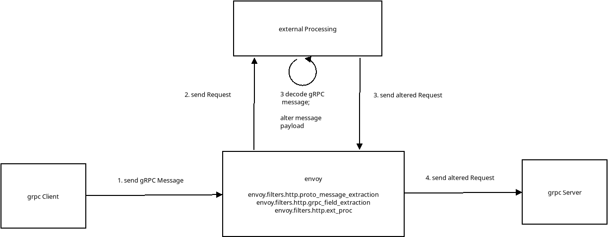

## Filtering gRPC Messages using Envoy

Envoy [External Processing Filter](https://www.envoyproxy.io/docs/envoy/latest/api-v3/extensions/filters/http/ext_proc/v3/processing_mode.proto) which decodes and alters gRPC messages.


In this flow, the envoy filter will recieve gRPC messages from clients over TLS, then decode and send an altered message to the gRPC Server.





This sample builds ontop of these articles:

* [Envoy External Processing Filter](https://blog.salrashid.dev/articles/2021/envoy_ext_proc/)
* [gRPC Unary requests the hard way: using protorefelect, dynamicpb and wire-encoding to send messages](https://blog.salrashid.dev/articles/2022/grpc_wireformat/)


Basically, the external filter will we will load the proto descriptors for the message type, then decode the grpc wire encoded message body,  construct a new message, encode the altered message back to wireformat  then finally send that to the upstream.


>> note, i've only tested this with unary messages (though streaming would be possible as well)

---

In this demo, the client sends a message "alice", and the grpc Server is supposed to respond back with "hi alice".  However with the external processing filter in the middle, the message sent is altered to instead read "bob" so the response is "hi bob"

First start the external filter and envoy

```bash
cd ext_proc/

# start external processing server
go run filter.go

## Start envoy
### docker cp `docker create envoyproxy/envoy-dev:latest`:/usr/local/bin/envoy .
envoy -c envoy_ext_proc.yaml -l debug
```


THen the grpc client and server.

```bash
cd grpc_server/

# run server
go run greeter_server/grpc_server.go --grpcport :50051 

# test client directly to server
# go run greeter_client/grpc_client.go --host localhost:50051

# test client via envoy
go run greeter_client/grpc_client.go --host localhost:8081
```


### Appendix

TODO: see if we can create a wasm filter to do the same (which isn't that easy since we need to decode the wireformat)
- [Envoy WASM Filter](https://github.com/salrashid123/envoy_wasm)
